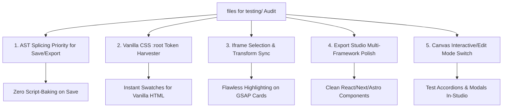

# Comprehensive Analysis of HTML Test Files & App Compatibility

**Document Version:** 1.0.0  
**Target:** Visual Style Editor (`Amoga-Media/visual-style-editor`)  
**Audit Directory:** `files for testing/`  
**Date:** September 2026

---

## 1. Executive Summary

The `files for testing` folder contains **9 real-world HTML test files** representing diverse frontend architectures, design paradigms, and complexity levels:
- **Tailwind CSS v3 CDN** (with and without custom inline `tailwind.config` scripts).
- **Tailwind CSS v4 Browser Runtime** (`@tailwindcss/browser@4`).
- **Pure Vanilla CSS** (with extensive `:root` CSS custom properties, glassmorphism, radial gradients, and keyframe animations).
- **Advanced Motion & Animation Systems** (GSAP 3.12, GSAP ScrollTrigger, mouse-reactive parallax, 3D tilt cards, magnetic buttons, custom cursor rings, text scrub reveals, marquee tickers).
- **Complex Multi-Section Landing Pages** (100KB+ complete production sites with accordions, bento grids, responsive multi-variant hero headers, modals, tab traps).
- **Prior Visual Style Editor (VSE) Exports** (containing injected `<style id="vse-responsive-styles">`, `data-vse-path` attributes, and inline overrides).

This document provides an exhaustive structural analysis of these files, audits how the application currently processes them, identifies potential edge cases and breaking points, and outlines concrete recommendations for our app to accept, inspect, visually edit, and export these files cleanly without breaking existing logic or layout.

---

## 2. Test Files Matrix & Classification

| # | File Name | Size | Framework / Mode | CSS Architecture | Fonts & Assets | JavaScript / Interactivity | Notable Features |
|---|---|---|---|---|---|---|---|
| 1 | `pricing-matrix.html` | 3.1 KB (69 lines) | **Tailwind v3 CDN** | Utility classes + VSE responsive stylesheet | Default system fonts | None | Dark-mode 2-column pricing cards, prior VSE responsive media queries |
| 2 | `saas-landing.html` | 1.4 KB (28 lines) | **Tailwind v4 CDN** | `@tailwindcss/browser@4` | Default system fonts | None | Minimal SaaS hero, arbitrary values (`text-[80px]`, `leading-[85px]`) |
| 3 | `saas-landing (1).html` | 1.4 KB (28 lines) | **Tailwind v4 CDN** | `@tailwindcss/browser@4` | Default system fonts | None | Span title modification variant (`text-[103px]`, `style="font-size: 22px;"`) |
| 4 | `saas-landing (2).html` | 1.4 KB (28 lines) | **Tailwind v4 CDN** | `@tailwindcss/browser@4` | Default system fonts | None | CTA button size modification variant (`text-[24px]`, `style="font-size: 10px;"`) |
| 5 | `gemini-code-1785182738541.html` | 9.8 KB (170 lines) | **Tailwind v3 CDN** | Tailwind utilities + custom `<style>` font declaration | Google Fonts (*Plus Jakarta Sans*), Unsplash images | Pure CSS animations (`animate-pulse`, `animate-ping`) | 5 absolute floating metric/badge cards, SVG decor arrows, backdrop blurs, arbitrary classes |
| 6 | `gemini-code-1785182456557 (1).html` | 18.8 KB (545 lines) | **Vanilla CSS (No Tailwind)** | `:root` custom properties, Glassmorphism, BEM-style classes | Google Fonts (*Plus Jakarta Sans*, *Inter*), Unsplash images | **GSAP 3.12.5**: timeline entrance, yoyo floaters, mousemove dynamic parallax | Dark edition AI co-pilot hero, SVG ray lines, animated CTA shine, responsive VSE cascade |
| 7 | `gemini-code-1785182269955.html` | 29.4 KB (848 lines) | **Vanilla CSS (No Tailwind)** | `:root` custom properties, Glassmorphism, card clusters | Google Fonts (*Plus Jakarta Sans*, *Inter*), Unsplash images | **GSAP 3.12.5**: timeline entrance, yoyo floaters, mousemove dynamic parallax | Light edition AI co-pilot hero, video player frame mockups, mini cards, captions badge |
| 8 | `besty-redesigned (6).html` | 104 KB (1410 lines) | **Tailwind v3 CDN + Config** | Tailwind utilities + `tailwind.config` + Custom `:root` CSS rules | Fontshare (*Satoshi*), Google Fonts (*JetBrains Mono*), FontAwesome 6 | **GSAP 3.12.2 + ScrollTrigger**: scrub progress, scrub reveals, word-by-word reveal, 3D tilt, magnetic hover, custom cursor ring | Complete multi-section commercial restaurant site: Sticky Nav, 3 Hero variants, Hype Marquee, Menu Accordions, Wings Bento, Reviews Carousel, Footer |
| 9 | `besty-redesigned (7).html` | 104 KB (1410 lines) | **Tailwind v3 CDN + Config** | Identical duplicate of `besty-redesigned (6).html` | Fontshare (*Satoshi*), Google Fonts (*JetBrains Mono*), FontAwesome 6 | **GSAP 3.12.2 + ScrollTrigger** | Exact replica used for repeatability / regression testing |

---

## 3. Deep-Dive File-by-File Breakdown

### 3.1 `pricing-matrix.html`
- **File Type**: Lightweight pricing component.
- **Key Characteristics**:
  - Script: ``.
  - Responsive Styles: Contains an embedded `<style id="vse-responsive-styles">` previously generated by Visual Style Editor with `html[data-vse-viewport="tablet"]` and `@media (max-width: 1024px)` rules.
  - Mix of inline styles (`style="font-size: 18px;"`) and Tailwind arbitrary classes (`text-[66px]`).
- **Compatibility Status in App**: Fully supported. Our AST engine and responsive cascade parser detect both the v3 CDN and the responsive style tag without conflict.

---

### 3.2 `saas-landing.html` & Variants (`(1)`, `(2)`)
- **File Type**: Tailwind v4 hero landing pages.
- **Key Characteristics**:
  - Script: ``.
  - Clean HTML structure without complex scripts or external frameworks.
  - Variants demonstrate inline style overrides colliding with Tailwind class sizes (e.g. `style="font-size: 40px;"` alongside `text-[80px]`).
- **Compatibility Status in App**: Fully supported. Mode is correctly detected as `"v4-cdn"`. Forward-mapping and inline style synchronization operate seamlessly.

---

### 3.3 `gemini-code-1785182738541.html`
- **File Type**: High-fidelity modern SaaS card layout.
- **Key Characteristics**:
  - Google Fonts link: `family=Plus Jakarta Sans:wght@400;500;600;700`.
  - 5 floating overlay badges layered above and below cards using `absolute`, `z-10`, `z-20`, `z-30`.
  - Micro-animations: `animate-pulse` on active dot, `animate-ping` on calling button.
  - Heavy arbitrary color values: `bg-[#E5E7EB]`, `bg-[#CCFF00]`, `w-[600px]`, `rounded-[32px]`.
- **Compatibility Status in App**:
  - Mode: `"v3-cdn"`.
  - DOM Inspection: The high `z-index` overlays and negative margins (`-top-32`, `-right-32`, `-bottom-6`) require precision bounding rect calculation in `SelectionOverlay.tsx`.
  - Bounding Box Highlights: The app's `body * { pointer-events: auto !important; }` helper correctly allows selecting nested cards and badges even when `pointer-events-none` is on background shapes.

---

### 3.4 `gemini-code-1785182456557 (1).html` & `gemini-code-1785182269955.html`
- **File Type**: Luxury AI landing page (Dark and Light editions) with GSAP motion system.
- **Key Characteristics**:
  - **No Tailwind CSS**: Built with pure Vanilla CSS and CSS custom properties (`:root { --bg: #09090b; --accent: #3b82f6; --card: rgba(...); }`).
  - Google Fonts: `Plus Jakarta Sans` and `Inter` via preconnect and display swap links.
  - Advanced CSS: Glassmorphism (`backdrop-filter: blur(16px)`), radial gradients, SVG background grids, `@keyframes shine` on CTA buttons.
  - **Active GSAP 3.12.5 Runtime**:
    - Staggered entrance animation timeline (`gsap.timeline()`).
    - Infinite looping yoyo animation on 6 floating image cards.
    - Global `window.addEventListener("mousemove", ...)` updating GSAP tweens on `.floater` elements based on mouse coordinates.
    - Media query matching via `gsap.matchMedia()` and `(prefers-reduced-motion: reduce)`.
- **Compatibility Insights**:
  - **Tailwind Mode**: Detected as `"none"`. All visual property panel edits fall back to inline styles and CSS injection, which is correct for Vanilla HTML.
  - **Color Palette**: Because colors are defined in `:root { --bg: ... }` rather than `@theme` or `tailwind.config`, the theme color token list is currently empty. Extracting `:root` CSS custom properties into color swatches will significantly elevate the editing experience.
  - **Live GSAP Animation**: Elements are constantly moving via CSS `transform`. When an element moves, `SelectionOverlay` must track the live transform or recalculate on animation frames.

---

### 3.5 `besty-redesigned (6).html` & `(7).html`
- **File Type**: 104KB production-grade restaurant landing page.
- **Key Characteristics**:
  - Script: `` with an inline `tailwind.config` containing custom palette extensions (`primary: '#050505'`, `accent: '#E63946'`, `accentYellow: '#FFC933'`, `surface: '#121212'`, `surface2: '#1A1A1A'`) and custom fonts (`Satoshi`, `JetBrains Mono`).
  - Typography: Fontshare CDN (`api.fontshare.com/v2/css?f[]=satoshi`) + FontAwesome 6 icons (`cdnjs.cloudflare.com/.../all.min.css`).
  - Advanced CSS motifs:
    - `.torn-edge::before`: Perforated receipt edge via `radial-gradient` repeating mask.
    - `.grain`: SVG fractal noise turbulence filter (`feTurbulence` data URI) overlay.
    - `.marquee__track`: Infinite marquee CSS animation.
    - `.ticket-card`: 3D hover translations with hard drop-shadows.
    - `.accordion-panel`: CSS Grid row transition (`grid-template-rows: 0fr -> 1fr`).
  - Advanced GSAP 3.12.2 + ScrollTrigger Runtime:
    - `#scroll-progress`: Scroll-scrubbed scale bar.
    - `.parallax-bg`: Background parallax on scroll.
    - `.story-scrub-text`: **Runtime text splitting**: JavaScript splits `.story-scrub-text` text content into individual `` elements dynamically on `DOMContentLoaded`.
    - `.magnetic`: Mouse-tracking magnetic CTA buttons using `gsap.quickTo`.
    - `.tilt-card`: 3D mouse-tracking rotation using `gsap.quickTo` with `rotationX` and `rotationY`.
    - `#cursor-ring`: Custom floating cursor ring following pointer.
    - Mobile menu overlay with full keyboard focus trap (`Tab`, `Shift+Tab`, `Escape`).
- **Compatibility Insights**:
  - `theme-v3.ts`: Successfully extracts `primary`, `accent`, `accentYellow`, `surface`, and `surface2` into the editor's color palette via Acorn AST parsing!
  - **Dynamic DOM Mutation Gotcha**: The script dynamically modifies DOM elements at load time (e.g. splitting `.story-scrub-text` into spans, injecting inline `transform` matrices on tilt cards). This highlights why the **AST Splicing Engine** must be prioritized over live DOM serialization for saving/exporting.

---

## 4. Architectural Analysis & Potential Breaking Points

### 4.1 Double-Engine Paradigm: AST Splicing vs DOM Serialization
The Visual Style Editor has two ways to generate output:
1. **Pristine AST Engine (`applyEditsClientSide`)**: Takes the pristine initial HTML string and applies precise token/attribute splices for only the edits made by the user in the visual panels.
2. **Live DOM Serializer (`serializeCleanDocument`)**: Takes `iframe.contentDocument`, strips editor-only helper attributes (`data-vse-*`, helper styles), and dumps `doc.documentElement.outerHTML`.

#### ⚠️ The Critical Risk with Complex JS Files:
In scripts like `besty-redesigned (6).html` and `gemini-code-1785182456557 (1).html`:
- On page load, GSAP attaches inline styles like `style="transform: matrix(1, 0, 0, 1, 14.2, -8.4); opacity: 1;"` and `style="clip-path: inset(0% 0% 0% 0%);"`.
- The script splits text into `` tags.
- The navigation script toggles `.nav-scrolled` or `.is-open` classes dynamically based on scroll position.
- If the editor serializes the live DOM, **these ephemeral runtime animation states get permanently baked into the saved HTML file**, breaking initial entrance animations and corrupting raw markup!
- **Solution / Recommendation**: The editor should **default to the Pristine AST Engine (`applyEditsClientSide`)** for all file saves and code copies whenever edits are present, ensuring 100% preservation of original code structure, scripts, and comments.

---

### 4.2 Tailwind Theme Detection vs Pure Vanilla CSS Custom Properties
- **Current Behavior**:
  - `detectTailwindMode` detects v3 and v4 CDN scripts.
  - `parseV3Theme` reads `tailwind.config` (works on `besty-redesigned`).
  - `parseV4Theme` reads `@theme` blocks inside `<style type="text/tailwindcss">`.
- **Gap Identified**:
  - For Vanilla CSS files like `gemini-code-1785182456557 (1).html` and `gemini-code-1785182269955.html`, colors and tokens are declared in standard `<style>` blocks under `:root { --bg: ...; --accent: ...; }`.
  - Currently, `parseV4Theme` only looks for `<style type="text/tailwindcss">` and `@theme`.
- **Solution / Recommendation**:
  - Enhance theme extraction to also parse standard CSS `:root { --color-*: ...; --*: ...; }` variables and add them to the visual swatch palette. This gives users immediate one-click access to theme colors in pure HTML/CSS files.

---

### 4.3 Iframe Interactive Elements & Motion Collisions
- **Issue**:
  - Files with magnetic buttons, parallax tracking, and custom cursor rings attach `mousemove`, `mouseenter`, `mouseleave`, and `click` listeners to `document` or `window`.
  - In `PreviewFrame.tsx`, our event listeners capture `click`, `mouseover`, `dragover`, etc., in the capture phase (`addEventListener(..., true)`).
  - This works well for selecting elements, but dragging sliders or clicking interactive components (like accordion triggers) inside the canvas can trigger unwanted navigation if `href` is present or trigger script animations.
- **Solution / Recommendation**:
  - `PreviewFrame.tsx` already cancels default on links during editor mode. We should ensure an **"Interaction Mode" toggle (Edit Mode vs Preview Mode)** exists in the toolbar so users can switch between manipulating styles visually and testing interactive JS scripts (accordions, carousels, mobile menus).

---

### 4.4 React / Next / Astro Export Studio Pipeline
- **Current Behavior**:
  - `html-to-jsx.ts` converts HTML attributes (`class` -> `className`, `for` -> `htmlFor`, inline `style` strings -> style objects, SVG attributes).
- **Edge Cases in Test Files**:
  1. **Embedded `<script>` tags**: Files like `besty-redesigned (6).html` contain extensive JS blocks (`gsap.registerPlugin(...)`). In React JSX/TSX, raw `<script>` tags inside components cause React warnings or syntax errors if not wrapped properly.
  2. **Font & Icon CDN Links**: `<link rel="stylesheet">` tags in `<head>` (such as Fontshare Satoshi and FontAwesome) should be cleanly organized into Next.js metadata/layout or Astro frontmatter during export.
  3. **Custom CSS Custom Properties in Style Strings**: `style="--floater-scale: 1; ..."` needs proper camelCase or quoted key handling (our `parseStyleStringToObject` handles `--` props correctly).

---

## 5. Actionable Roadmap & Enhancements

Based on the audit of all 9 test files, here is the prioritized action plan for Visual Style Editor:

### Recommendation 1: Prioritize AST Splicing in `EditorStudio.tsx`
- In `EditorStudio.tsx` (`handleSave`, `getCurrentExportHtml`), prioritize `applyEditsClientSide(openFile.content, edits)` as the primary output generator when edits exist.
- Fallback to `serializeCleanDocument` only for unsaved structural drags where AST splicing has no parent reference.
- **Benefit**: Ensures runtime GSAP transforms, dynamic DOM word spans, and script mutations never pollute the saved file.

### Recommendation 2: Harvester for Vanilla CSS `:root` Custom Properties
- Add a `:root` CSS variable parser in `src/lib/tailwind/` or `src/lib/dom/`:
  - Scans all `<style>` blocks in the document for `:root { --*: #hex|rgb|hsl }`.
  - Surfaces these colors directly in `ColorPicker.tsx` / `ColorGroup.tsx` as "Document Palette".
- **Benefit**: First-class theme palette support for non-Tailwind files (`gemini-code-1785182456557 (1).html` and `gemini-code-1785182269955.html`).

### Recommendation 3: Transform-Aware Selection Highlight Loop
- When an element is animated with GSAP (yoyo floating, 3D tilt), update `SelectionOverlay` bounding box via `requestAnimationFrame` or throttled observer when an animated element is actively selected.
- **Benefit**: The selection bounding box stays glued to the moving element at 60fps without desyncing.

### Recommendation 4: Script-Aware Export Transformations
- In `html-to-jsx.ts` and `html-to-astro.ts`:
  - Separate static markup from `<script>` blocks.
  - In React TSX export, wrap client scripts into a `useEffect(() => { ... }, [])` hook or provide clean warnings.
  - In Astro export, preserve `<script>` tags directly in the `.astro` template body where Astro natively executes client scripts.

---

## 6. Conclusion

The testing files present in `files for testing/` cover the full spectrum of modern web design—from minimalist Tailwind v4 landing pages to high-end GSAP-driven editorial web experiences and pure Vanilla CSS glassmorphism.

By implementing the recommendations above, Visual Style Editor will reliably handle all of these files, providing instant visual editing, real-time feedback, and pristine, lossless exports across HTML, React, Next.js, and Astro.
