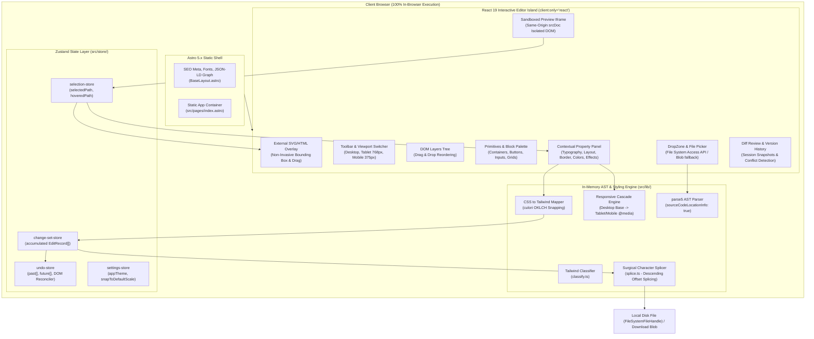

# Visual Style Editor — Comprehensive Project Overview & Architecture Reference

> **Document Type:** Project Discovery, Technical Reference & Architecture Overview  
> **Target Audience:** Core Developers, AI Coding Agents, System Architects, UI/UX Engineers  
> **Codebase Target:** Visual HTML & Tailwind CSS Style Editor (Web Edition)  
> **Verified Version:** v1.0.0 (Astro 5.x + React 19 Islands + In-Browser AST Engine)  
> **Verification Status:** 42/42 test files passed, 298/298 unit & integration tests passing  

---

## 1. Project Overview

### 1.1 Project Name & Definition
* **Name:** Visual Style Editor (`visual-style-editor`)
* **Type:** 100% In-Browser Visual HTML & Tailwind CSS Editor (Client-Side Web Application)
* **Hosting / Architecture Model:** Zero-backend static web application powered by **Astro 5.x** static site generation (SSG) hosting an isolated **React 19 Island** (`EditorStudio.tsx`).

### 1.2 Problem Statement & Core Purpose
Building modern web interfaces with AI coding tools (Claude, ChatGPT, Cursor, v0, Bolt) frequently generates clean HTML and Tailwind CSS markup. However:
1. **Prompt Fatigue & Latency for Micro-Adjustments:** Tweaking small visual details (e.g., *“shift this button 4px right”*, *“change text to 18px”*, *“darken this purple background”*, or *“adjust padding on mobile”*) requires multiple rounds of natural language prompts, 20–30s latency per turn, and risks AI hallucination that destroys surrounding code structure.
2. **Outdated or Cost-Prohibitive Tooling:** Legacy free editors (TinyMCE/CKEditor wrappers) corrupt modern CSS, inject inline spans, and lack Tailwind awareness. Modern visual web builders (Webflow, Framer, Windframe) are closed-source, require subscriptions ($20–$50/mo), and lock users into proprietary hosting models.
3. **Loss of Code Hygiene:** Typical WYSIWYG editors rewrite entire HTML files upon saving, destroying comments, altering indentation, and stripping dynamic script tags (GSAP, Swiper, custom analytics).

### 1.3 Intended Users & Personas
* **"Vibe Coders" & Indie Builders:** Individuals who generate HTML/Tailwind with AI agents and want immediate visual sliding controls for colors, typography, margins, and layout without prompt cycles.
* **Marketers & Growth Managers:** Non-developers updating headlines, CTA copy, image URLs, and button destinations in HTML templates without requiring developer pull requests.
* **UI/UX Designers & Freelancers:** Designers verifying responsive layouts, prototyping visual tweaks, and exporting exact Tailwind utility classes or clean HTML.
* **Frontend Developers:** Engineers inspecting and tweaking CSS in real time with surgical byte-level character preservation that preserves Git diffs, indentation, script tags, and comments.

### 1.4 Current State of Development
* **Development Phase:** Production-ready client-side web application (Sprint 10 completed).
* **Architecture Evolution:** Successfully migrated from an older monorepo architecture with a local Node.js server to a **100% client-side in-browser execution model** running on Astro 5 + React 19. All HTML parsing, token extraction, live style rendering, responsive cascading, and character-level AST splicing run entirely inside the user's browser with 0ms network latency and $0 hosting overhead.

---

## 2. Technology Stack

| Layer / Role | Technology | Package Version | Where Used & Purpose |
| :--- | :--- | :--- | :--- |
| **Framework Shell** | Astro | `^5.4.1` | Root application entry point (`src/pages/index.astro`, `src/layouts/BaseLayout.astro`), static HTML generation, SEO metadata, JSON-LD schemas. |
| **Island Runtime** | React & React-DOM | `^19.0.0` | Powers the interactive visual editor island (`src/components/editor/EditorStudio.tsx`) mounted via `client:only="react"`. |
| **Integration Bridge** | `@astrojs/react` | `^4.2.1` | Enables seamless hydration and mounting of React 19 components inside Astro layouts. |
| **Styling Engine** | Tailwind CSS & `@tailwindcss/vite` | `^4.0.9` | Studio application UI styling, dark mode theming, and layout primitives. |
| **AST HTML Parser** | `parse5` | `^7.2.1` | In-memory HTML5 parsing (`src/lib/ast/`) with `sourceCodeLocationInfo: true` providing exact byte offsets for surgical character splicing. |
| **Color Math & Snapping** | `culori` | `^4.0.2` | Perceptual color math using Euclidean distance in the **OKLCH** color space (`src/lib/tailwind/forward-map.ts`) to snap arbitrary hex/rgb values to Tailwind palette swatches. |
| **State Management** | Zustand | `^5.0.3` | Lightweight in-memory state stores for element selection, active change-sets, application settings, and undo/redo history (`src/store/`). |
| **UI Iconography** | `lucide-react` | `^0.475.0` | Studio toolbar icons, property panel toggles, layer hierarchy tree icons, and modal dialogs. |
| **UI Animation Engine** | `framer-motion` | `^12.4.7` | Smooth transitions, modal spring animations, and panel expansion micro-interactions. |
| **CSS Class Utilities** | `clsx` & `tailwind-merge` | `^2.1.1` / `^3.0.2` | Conditional class composition and style resolution in UI components. |
| **SEO & Sitemaps** | `@astrojs/sitemap` | `^3.2.1` | Generates sitemap XML files during Astro static build (`astro.config.mjs`). |
| **Testing Framework** | Vitest & jsdom | `^3.0.7` / `^26.0.0` | In-memory unit and integration testing suite (`test/`), verifying AST transformations, DOM reconciliation, and Tailwind mappings. |
| **Language & Build Tool** | TypeScript & Vite | `^5.7.3` / bundled | Strict type safety, JSX/TSX compilation, module aliasing (`@/*` -> `./src/*`). |

---

## 3. Project Structure

```text
visual-style-editor/
├── .agents/                        # AI agent customization roots and skill definitions
│   └── skills/                     # Domain skills (Astro, Tailwind, GSAP, UI guidelines)
├── .astro/                         # Astro internal cache and generated type declarations
├── dist/                           # Production build output directory (static HTML, JS, CSS)
├── docs/                           # Architectural, product, and roadmap documentation
│   ├── PRD-visual-html-editor.md   # Product requirements document
│   ├── TRD-visual-html-editor.md   # Technical requirements document
│   ├── app-flow.md                 # User journey and dataflow diagrams
│   ├── astro-web-app-architecture.md# Astro migration and in-browser engine strategy
│   ├── backend-schema.md           # Domain contracts, types, and AST splice specs
│   ├── features-and-improvements-roadmap.md # Roadmap & milestone tracker
│   ├── implementation-plan.md      # Multi-sprint implementation log
│   ├── migration-guide-astro.md    # Guide documenting elimination of Node backend
│   └── task-board.md               # 42-task execution tracker (100% complete)
├── public/                         # Static public assets served at root
│   ├── favicon.svg                 # Application favicon
│   └── robots.txt                  # Search crawler directives
├── src/                            # Source code root
│   ├── components/                 # UI components
│   │   ├── astro/                  # Reserved for static Astro components
│   │   └── editor/                 # React 19 visual studio components
│   │       ├── BasicComponents.tsx # Primitives insertion palette (Containers, Grids, Buttons, Inputs)
│   │       ├── Breadcrumbs.tsx     # Bottom DOM path breadcrumb trail
│   │       ├── ComponentBlocks.tsx # Pre-built UI template blocks insertion panel
│   │       ├── DropZone.tsx        # Drag-and-drop file ingestion & sample template loader
│   │       ├── EditorStudio.tsx    # Master container component coordinating canvas, panels & stores
│   │       ├── InlineTextEditor.tsx# Content copy editing overlay (double-click inline text)
│   │       ├── KeyboardShortcutsModal.tsx # Shortcuts cheatsheet modal (?)
│   │       ├── LayersTree.tsx      # DOM hierarchy explorer with drag-and-drop layer reordering
│   │       ├── PreviewFrame.tsx    # Sandboxed preview <iframe> with event delegators & drag targets
│   │       ├── PropertyPanel.tsx   # Master style property sidebar and contextual element classifier
│   │       ├── ReviewModal.tsx     # Visual diff review modal showing before/after code changes
│   │       ├── SelectionOverlay.tsx# External SVG/HTML bounding box overlay & drag-to-position engine
│   │       ├── Toolbar.tsx         # Top application header (viewports, undo/redo, zoom, copy, save)
│   │       ├── VersionHistory.tsx  # In-session snapshot backup drawer with 1-click downloads
│   │       └── property-panel/     # Granular visual styling control groups
│   │           ├── AdvancedCssGroup.tsx   # Direct CSS property key/value override inspector
│   │           ├── BorderGroup.tsx        # 4-sided border width, style, color & corner radius
│   │           ├── ColorGroup.tsx         # Text color, background color & theme swatch picker
│   │           ├── ColorPicker.tsx        # Custom color picker with hex, rgba, and palette presets
│   │           ├── EffectsGroup.tsx       # Opacity, backdrop blur, cursor, rotate & scale
│   │           ├── ElementActionsGroup.tsx# Duplicate, delete, move up, move down controls
│   │           ├── FlexGridGroup.tsx      # Flexbox & CSS Grid alignment, direction & gap
│   │           ├── ImageGroup.tsx         # Image src URL, alt text, object-fit & aspect ratio
│   │           ├── LayoutGroup.tsx        # Width/height, min/max constraints & 4-sided padding/margin
│   │           ├── LinkGroup.tsx          # Anchor href, target window & rel attributes
│   │           ├── PositionGroup.tsx      # Position mode (rel/abs/fix/sticky), pinning (top/right/bottom/left), z-index & overflow
│   │           ├── SvgGroup.tsx           # SVG fill, stroke, stroke-width controls
│   │           ├── TypographyGroup.tsx    # Font family, size, weight, line-height, spacing & alignment
│   │           └── ValueInput.tsx         # Bidirectional slider + numeric input with unit dropdown
│   ├── layouts/
│   │   └── BaseLayout.astro        # Base HTML shell with SEO meta, Google Fonts, JSON-LD & FOUC prevention
│   ├── lib/                        # Core algorithmic libraries & domain logic
│   │   ├── ast/                    # In-browser HTML parsing & surgical character splicing
│   │   │   ├── analyze.ts          # Orchestrates client-side location mapping & Tailwind detection
│   │   │   ├── apply-edits.ts      # Applies consolidated attribute, text & structural AST splices
│   │   │   ├── build-location-map.ts# Parses HTML via parse5 with byte coordinate tracking
│   │   │   ├── parse5-adapter.ts   # Helper adapter for parse5 node traversals and attribute access
│   │   │   ├── resolve-path.ts     # Resolves structural paths to parse5 AST nodes
│   │   │   ├── splice.ts           # Character-level slice replacement applying splices in descending byte order
│   │   │   ├── structural-path.ts  # Generates deterministic `#id` or `tag:nth-of-type(n)` paths
│   │   │   └── style-attr.ts       # Parses and sets individual CSS properties in inline `style` strings
│   │   ├── dom/                    # Live DOM manipulation, measurement & responsive cascade
│   │   │   ├── class-list-mutation.ts # Adds/removes Tailwind utility classes without colliding
│   │   │   ├── computed-style.ts   # Extracts live computed styles and units from iframe elements
│   │   │   ├── dom-adapter.ts      # DOM adapter for structural path resolution
│   │   │   ├── element-classifier.ts# Contextual element categorization (Text, Button, Container, Image, etc.)
│   │   │   ├── live-style-engine.ts# 60fps style mutation engine and Tailwind forward mapper
│   │   │   ├── resolve-live-path.ts# Queries DOM elements in iframe via data-vse-path or structural paths
│   │   │   ├── responsive-style-engine.ts # Isolated responsive style registry & @media stylesheet injection
│   │   │   ├── style-edit.ts       # Helper for creating style edit records
│   │   │   └── unit-conversion.ts  # Converts px, rem, em, %, vw, vh units
│   │   ├── fonts/
│   │   │   └── google-fonts.ts     # Curated Google Fonts catalog, dynamic link generation & head injection
│   │   ├── fs/                     # Client-side file ingestion, File System Access API & export
│   │   │   ├── download.ts         # Browser Blob download fallback for Firefox/Safari
│   │   │   ├── file-system-access.ts# Native FileSystemFileHandle direct disk read/write
│   │   │   ├── is-html-file.ts     # Validates `.html`/`.htm` file types
│   │   │   ├── select-drop-candidate.ts # Extracts first valid HTML file from multi-file drop arrays
│   │   │   └── version-history.ts  # Formats pre-save version labels and download filenames
│   │   └── tailwind/               # Tailwind theme extraction, class classification & OKLCH color snapping
│   │       ├── classify.ts         # Classifies Tailwind class strings to editable property domains
│   │       ├── default-theme.ts    # Standard Tailwind v3/v4 spacing, color and font token constants
│   │       ├── detect-mode.ts      # Detects Tailwind v3 CDN vs v4 browser CDN vs plain CSS
│   │       ├── forward-map.ts      # Maps property values to Tailwind classes using culori OKLCH snapping
│   │       ├── theme-v3.ts         # Extracts custom `tailwind.config` JS tokens
│   │       └── theme-v4.ts         # Extracts custom `@theme` CSS variables
│   ├── store/                      # Zustand in-memory state stores
│   │   ├── change-set-store.ts     # Accumulates and deduplicates pending edits
│   │   ├── selection-store.ts      # Tracks currently selected and hovered structural paths
│   │   ├── settings-store.ts       # Application theme (dark/light) & snapping preferences
│   │   └── undo-store.ts           # Undo/redo stack management & live iframe DOM reconciliation
│   ├── styles/
│   │   └── global.css              # Framer-grade design system tokens, canvas dot grid & scrollbars
│   └── types/
│       └── index.ts                # Canonical TypeScript domain types & edit record definitions
├── test/                           # Test suite (36 files, 283 tests)
│   ├── ast/                        # AST parser, splicer, path resolver & theme extraction tests
│   ├── editor/                     # Studio stores, classifier, responsive cascade & DOM tests
│   └── tailwind/                   # Forward mapping, classification & default theme tests
├── astro.config.mjs                # Astro 5 configuration with React, Tailwind & sitemap plugins
├── BUGS-AND-CHANGES.md             # Historical record of bug fixes and architectural updates
├── DESIGN.md                       # Comprehensive design system specification (Framer aesthetic)
├── package.json                    # Project dependencies and script commands
├── tsconfig.json                   # TypeScript configuration with `@/*` path mapping
└── vitest.config.ts                # Vitest test runner configuration
```

---

## 4. Application Architecture



### 4.1 Layer Communication & Dataflow
1. **Zero-Backend Architecture:** The server exists solely to deliver static assets during build time. There is no runtime backend server, no Docker container, and no remote database.
2. **Isolation Principle:** The user's document renders inside a sandboxed `<iframe>` (`srcDoc`). The selection bounding box, resize handles, and hover highlights render in the parent React application overlay using coordinates computed via `getBoundingClientRect()`. No extraneous classes, DOM nodes, or inline scripts are ever injected into the user's HTML source.
3. **Live 60fps Manipulation vs. Release Commit:**
   - *During Active Dragging:* The property panels mutate `element.style` directly or update the responsive stylesheet in real time at 60fps to prevent frame drops.
   - *On Blur / Mouse Up:* The final value is passed to `forwardMap()`, classified into Tailwind classes or inline CSS, recorded in `change-set-store`, and pushed to `undo-store`.
4. **Surgical AST Splicing:** When saving or generating diffs, `applyEditsClientSide()` computes character-level byte offsets and splices only modified tokens in descending byte order, guaranteeing that comments, indentation, custom scripts (GSAP, Swiper), and external libraries remain 100% pristine.

---

## 5. Complete Module Inventory

### Module 1: Entry & Layout Shell (`src/pages/`, `src/layouts/`)
* **Purpose:** Host the application, provide SEO metadata, manage dark/light theme initialization, and mount the React editor island.
* **Important Files:** `src/pages/index.astro`, `src/layouts/BaseLayout.astro`, `src/styles/global.css`.
* **Current Status:** Complete.

### Module 2: File Ingestion & Persistence (`src/lib/fs/`, `src/components/editor/DropZone.tsx`)
* **Purpose:** Handle drag-and-drop file ingestion, sample template loading, File System Access API disk writes (Chromium), and Blob download fallbacks (Safari/Firefox).
* **Important Files:** `DropZone.tsx`, `file-system-access.ts`, `download.ts`, `select-drop-candidate.ts`, `is-html-file.ts`, `version-history.ts`.
* **Current Status:** Complete.

### Module 3: Canvas, Preview & Selection Engine (`src/components/editor/`)
* **Purpose:** Render user HTML in an isolated iframe, track element coordinates, render non-invasive selection overlays, and support drag-and-drop component insertion.
* **Important Files:** `PreviewFrame.tsx`, `SelectionOverlay.tsx`, `Breadcrumbs.tsx`.
* **Current Status:** Complete.

### Module 4: DOM Layers Hierarchy & Structural Mutations (`src/components/editor/LayersTree.tsx`)
* **Purpose:** Display expandable DOM tree, highlight elements on hover, provide layer drag-and-drop reordering, element deletion, duplication, and reordering.
* **Important Files:** `LayersTree.tsx`, `ElementActionsGroup.tsx`, `src/lib/ast/apply-edits.ts`.
* **Current Status:** Complete.

### Module 5: Component & Primitives Palette (`src/components/editor/BasicComponents.tsx`, `ComponentBlocks.tsx`)
* **Purpose:** Provide drag-and-drop and click-to-insert palettes of atomic HTML structures (Containers, Sections, 2/3-Column Grids, Flex Rows, Buttons, Inputs) and complex pre-styled UI blocks (Heroes, Pricing, Testimonials, Footers).
* **Important Files:** `BasicComponents.tsx`, `ComponentBlocks.tsx`.
* **Current Status:** Complete.

### Module 6: Property Panel & Visual Controls (`src/components/editor/PropertyPanel.tsx`, `property-panel/*`)
* **Purpose:** Inspect and mutate typography, layout, sizing, 4-sided padding/margin, 4-sided borders, corner radii, colors, positioning, flexbox/grid, effects, image URLs, and anchor links.
* **Important Files:** `PropertyPanel.tsx`, `LayoutGroup.tsx`, `PositionGroup.tsx`, `TypographyGroup.tsx`, `BorderGroup.tsx`, `ColorGroup.tsx`, `ColorPicker.tsx`, `EffectsGroup.tsx`, `FlexGridGroup.tsx`, `ImageGroup.tsx`, `LinkGroup.tsx`, `SvgGroup.tsx`, `ValueInput.tsx`.
* **Current Status:** Complete.

### Module 7: Responsive Cascade Engine (`src/lib/dom/responsive-style-engine.ts`)
* **Purpose:** Support multi-viewport editing (Desktop Global Base, Tablet 768px override, Mobile 375px override) with real-time `@media` stylesheet injection in the iframe and inheritance tracking.
* **Important Files:** `responsive-style-engine.ts`, `Toolbar.tsx`.
* **Current Status:** Complete.

### Module 8: In-Browser AST & Splicing Engine (`src/lib/ast/`)
* **Purpose:** Parse raw HTML into `parse5` trees, resolve deterministic structural paths, map CSS properties to Tailwind tokens, apply OKLCH color snapping via `culori`, and perform surgical character splices.
* **Important Files:** `apply-edits.ts`, `build-location-map.ts`, `resolve-path.ts`, `splice.ts`, `structural-path.ts`, `style-attr.ts`, `analyze.ts`.
* **Current Status:** Complete.

### Module 9: Tailwind Detection & Mapping Engine (`src/lib/tailwind/`)
* **Purpose:** Detect Tailwind CDN modes (v3 vs v4), parse custom CSS `@theme` variables or JS config tokens, classify classes to property types, and map computed values back to utility classes.
* **Important Files:** `classify.ts`, `forward-map.ts`, `detect-mode.ts`, `theme-v3.ts`, `theme-v4.ts`, `default-theme.ts`.
* **Current Status:** Complete.

### Module 10: State Management & Undo/Redo Engine (`src/store/`)
* **Purpose:** Store active selection, accumulate and deduplicate edit change-sets, manage application preferences, and provide multi-step undo/redo with live DOM reconciliation.
* **Important Files:** `change-set-store.ts`, `selection-store.ts`, `settings-store.ts`, `undo-store.ts`.
* **Current Status:** Complete.

### Module 11: Review, Version History & Export (`src/components/editor/ReviewModal.tsx`, `VersionHistory.tsx`)
* **Purpose:** Provide a side-by-side diff review modal, 1-click clipboard HTML export, in-session pre-save backup snapshots, and conflict resolution warnings.
* **Important Files:** `ReviewModal.tsx`, `VersionHistory.tsx`.
* **Current Status:** Complete.

---

## 6. Module Connections & Dependencies

```text
                                [ User Drops HTML / Chooses File ]
                                                │
                                                ▼
                                    ┌───────────────────────┐
                                    │     DropZone.tsx      │
                                    └───────────┬───────────┘
                                                │
                                                ▼
                                    ┌───────────────────────┐
                                    │    EditorStudio.tsx   │
                                    └───────────┬───────────┘
               ┌────────────────────────────────┼────────────────────────────────┐
               ▼                                ▼                                ▼
    ┌───────────────────────┐       ┌───────────────────────┐       ┌───────────────────────┐
    │    PreviewFrame.tsx   │       │     LayersTree.tsx    │       │   PropertyPanel.tsx   │
    │  (Iframe DOM Canvas)  │       │  (DOM Node Explorer)  │       │  (Style & Copy Groups)│
    └──────────┬────────────┘       └───────────┬───────────┘       └───────────┬───────────┘
               │                                │                               │
               ├────────────────────────────────┴───────────────────────────────┤
               │ Mouse Click / Hover / Drag Event                               │
               ▼                                                                ▼
    ┌───────────────────────┐                                       ┌───────────────────────┐
    │  selection-store.ts   │                                       │ live-style-engine.ts  │
    └──────────┬────────────┘                                       │ responsive-engine.ts  │
               │                                                    └───────────┬───────────┘
               ▼                                                                │
    ┌───────────────────────┐                                                   │ On Commit
    │ SelectionOverlay.tsx  │                                                   ▼
    │ (External Bounding Box│                                       ┌───────────────────────┐
    └───────────────────────┘                                       │  change-set-store.ts  │
                                                                    │    undo-store.ts      │
                                                                    └───────────┬───────────┘
                                                                                │
                                                                                │ Click Save / Diff
                                                                                ▼
                                                                    ┌───────────────────────┐
                                                                    │  apply-edits.ts (AST) │
                                                                    │      splice.ts        │
                                                                    └───────────┬───────────┘
                                                                                │
                                                                                ▼
                                                                    ┌───────────────────────┐
                                                                    │  file-system-access   │
                                                                    │  (Direct Disk / Blob) │
                                                                    └───────────────────────┘
```

### 6.1 Inter-Module Dataflow Contracts
* **Selection:** `PreviewFrame` detects element clicks -> computes `structuralPath` via `computeStructuralPath()` -> updates `selection-store` -> `PropertyPanel` and `LayersTree` synchronize and highlight the selected element.
* **Live Style Tweaks:** Slider/color interaction in `PropertyPanel` invokes `applyLiveStyle()` -> mutates `element.style` or injects `@media` rules into iframe -> on release, invokes `forwardMap()` -> generates Tailwind class or CSS style -> pushes `EditRecord` to `change-set-store` and `undo-store`.
* **Undo/Redo:** User presses `Ctrl+Z` -> `undo-store` retrieves previous snapshot -> invokes `reconcileDom()` -> updates live iframe element properties and syncs `change-set-store`.
* **Save / Export:** User clicks "Review & Save" -> `applyEditsClientSide()` passes current HTML + accumulated `SaveRequestEdit[]` -> sorts splices descending by byte offset -> produces clean HTML -> writes directly to disk handle via `FileSystemFileHandle` or triggers browser download.

---

## 7. Database & Data Model

> **Note on Persistence:** Because this application runs 100% in-browser with zero telemetry and zero server tracking, there is **no SQL/NoSQL database**. Application state is partitioned into memory lifecycles and disk files.

### 7.1 Domain Entity Specifications (`src/types/index.ts`)

#### 7.1.1 Structural Path Grammar
The `structuralPath` string uniquely identifies any element in an HTML document:
```text
StructuralPath := IdPath | ChainPath
IdPath         := "#" Identifier
ChainPath      := Step ( ">" Step )*
Step           := TagName ":nth-of-type(" PositiveInteger ")"
```
*Example:* `html:nth-of-type(1) > body:nth-of-type(1) > main:nth-of-type(1) > section:nth-of-type(2) > h1:nth-of-type(1)` or `#hero-title`.

#### 7.1.2 EditRecord Discriminated Union
```typescript
export type EditRecord =
  | ClassEditRecord      // Tailwind class alterations
  | StyleEditRecord      // Inline CSS property modifications
  | TextEditRecord       // Inner text content revisions
  | AttributeEditRecord  // HTML attribute tweaks (src, alt, href, target)
  | DeleteEditRecord     // Node deletion
  | DuplicateEditRecord  // Node duplication
  | InsertEditRecord     // Component block or primitive insertion
  | MoveEditRecord;      // Layer reordering (inside, before, after)
```

#### 7.1.3 AST Splice Structure
```typescript
export interface Splice {
  startOffset: number; // 0-indexed byte start position in original source
  endOffset: number;   // 0-indexed byte end position in original source
  replacement: string; // The replacement string
}
```
**Splicing Invariant:** All splices are sorted in **descending order of `startOffset`** before being applied so that earlier replacements never alter the character coordinates of subsequent edits.

---

## 8. Authentication & Authorization

* **Authentication Model:** None (100% Public, Free, Zero-Login Tool).
* **Access Control & Permissions:**
  * Browser-level permissions: Uses the browser's native **File System Access API** permissions model (`queryPermission`, `requestPermission` for mode `readwrite`).
  * If write permission is denied or unsupported (Firefox/Safari), the app gracefully falls back to direct browser Blob downloads.
* **Security Sandboxing:**
  * Previews render inside an isolated `<iframe>` using `srcDoc`.
  * External CSS overlays prevent malicious or malformed scripts inside user-loaded HTML files from breaking parent application state.

---

## 9. Major User Flows

### Flow 1: Drop HTML & Visually Tweak Styles
```text
User visits webapp URL
  ↓
Drags .html file onto DropZone (or picks starter template)
  ↓
AST analyzes Tailwind CDN & extracts theme tokens in-memory (< 3ms)
  ↓
Preview renders in isolated iframe
  ↓
User clicks an element (e.g. CTA Button)
  ↓
PropertyPanel displays contextual controls (Typography, Padding, Colors)
  ↓
User drags padding slider & picks brand color from palette
  ↓
Live preview updates at 60fps
  ↓
On slider release, forwardMap generates Tailwind utility classes
  ↓
Change-set records EditRecord
  ↓
User clicks "Review & Save" -> Diff Modal opens
  ↓
User confirms Save -> FileSystemFileHandle writes directly to disk in place
```

### Flow 2: Double-Click Inline Text Copy Editing
```text
User double-clicks text element (e.g. <h1> or <p>) on canvas
  ↓
InlineTextEditor opens inline textarea with autoFocus
  ↓
User types new copy
  ↓
User presses Enter or clicks Apply
  ↓
Live element textContent updates in iframe
  ↓
TextEditRecord recorded in changeSetStore
  ↓
AST Splicer replaces character range between startTag.endOffset and endTag.startOffset
```

### Flow 3: Layer Reordering via Drag & Drop
```text
User opens Left Sidebar -> selects "Layers" tab
  ↓
LayersTree renders nested DOM hierarchy
  ↓
User drags a <div> node and drops it "inside" or "after" another element
  ↓
DOM node moves inside iframe
  ↓
MoveEditRecord recorded in changeSetStore with source and target structural paths
  ↓
AST Splicer moves element slice to target position upon Save
```

---

## 10. Frontend Pages & UI Structure

### 10.1 Root Page (`src/pages/index.astro`)
* **Route:** `/`
* **Layout:** `BaseLayout.astro`
* **Content:** Full-viewport container hosting `<EditorStudio client:only="react" />`.

### 10.2 Studio Shell Layout (`src/components/editor/`)
1. **Toolbar (`Toolbar.tsx`):**
   - Left: Sidebar toggle, brand badge, loaded file name, "Change File" button, status pill.
   - Center: Undo/Redo buttons (`Ctrl+Z` / `Ctrl+Y`), Viewport mode switcher (Desktop, Tablet 768px, Mobile 375px), Canvas zoom controls (50% to 150%).
   - Right: Light/Dark theme toggle, Snapping checkbox, Copy HTML button, Version History drawer toggle, Keyboard Shortcuts modal toggle (`?`), Review & Save button.
2. **Left Sidebar (`LayersTree.tsx`, `BasicComponents.tsx`, `ComponentBlocks.tsx`):**
   - Tab 1 (`Layers`): Expandable DOM hierarchy tree with layer drag-and-drop, hover highlights, element deletion, duplication, and reordering.
   - Tab 2 (`Primitives`): 12 atomic HTML structures (Containers, 2/3 Grids, Sections, Headings, Paragraphs, Buttons, Inputs, Textareas, Images, Links).
   - Tab 3 (`Templates`): 6 pre-styled responsive UI blocks (Heroes, Pricing, Features, Testimonials, Footers).
3. **Canvas Viewport (`PreviewFrame.tsx`, `SelectionOverlay.tsx`, `Breadcrumbs.tsx`):**
   - Centered artboard with dot matrix background.
   - Authentic device frames with speaker notch and home bar for Tablet and Mobile viewports.
   - Bottom breadcrumb navigation (`body > section > div > button`).
4. **Right Sidebar (`PropertyPanel.tsx`):**
   - Contextual visual property groups tailored to the active element type.
   - "Contextual" vs "All" property mode toggle.
   - Viewport cascade indicator (Desktop Base vs Tablet/Mobile Override).

---

## 11. Forms, Validation & User Input

* **Direct Numeric & Unit Inputs (`ValueInput.tsx`):** Bidirectional synchronization between range sliders and text inputs with unit selector (`px`, `rem`, `%`, `vw`, `vh`, `auto`).
* **Color Picker (`ColorPicker.tsx`):** Interactive color picker supporting Hex, RGB, HSL, alpha opacity slider, and one-click Tailwind color swatches.
* **Inline Textarea (`InlineTextEditor.tsx`):** Multiline copy editor supporting Enter-to-apply and Escape-to-cancel.
* **Media & Link Inputs (`ImageGroup.tsx`, `LinkGroup.tsx`):** Direct image URL inputs with broken-link fallback preview, `alt` text input, `aspect-ratio` selector, anchor `href` input, and `target="_blank"` toggle.
* **File Validation (`is-html-file.ts`, `select-drop-candidate.ts`):** Validates dropped files against `.html` and `.htm` extensions and MIME types, filtering out non-HTML files gracefully.

---

## 12. API & Backend Operations

* **Server Runtime Endpoints:** None (100% Client-Side In-Browser).
* **Client-Side AST Operations (`src/lib/ast/`):**
  * `analyzeHtmlClientSide(html: string)`: Parses HTML string, builds location map, detects Tailwind v3/v4 CDN scripts and theme variables.
  * `applyEditsClientSide(html: string, edits: SaveRequestEdit[])`: Consolidates multiple edits by element, calculates character offsets, and splices clean strings into the baseline HTML.
* **File Persistence Operations (`src/lib/fs/`):**
  * `ensureWritePermission(handle)`: Prompts user for browser disk write access.
  * `writeToHandle(handle, content)`: Overwrites the local file on disk in place via Chromium File System Access API.
  * `downloadHtml(filename, content)`: Triggers instantaneous client-side Blob download.

---

## 13. State Management & Data Flow

| Store | File Location | Key State Variables | Responsibilities |
| :--- | :--- | :--- | :--- |
| **Selection Store** | `src/store/selection-store.ts` | `selectedPath`, `hoveredPath` | Stores active element structural path; synchronizes selection overlay and sidebar inspectors. |
| **Change-Set Store** | `src/store/change-set-store.ts` | `edits: EditRecord[]` | Accumulates, merges, and deduplicates pending style, class, text, and structural edits. |
| **Undo Store** | `src/store/undo-store.ts` | `past: EditRecord[][]`, `future: EditRecord[][]` | Manages undo/redo stacks; executes `reconcileDom()` to synchronize live iframe DOM upon undo/redo actions. |
| **Settings Store** | `src/store/settings-store.ts` | `appTheme: "dark" \| "light"`, `snapToDefaultScale: boolean` | Manages dark/light studio theming and Tailwind scale snapping preferences in `localStorage`. |

---

## 14. Integrations & External Services

1. **Google Fonts CDN (`https://fonts.googleapis.com`):**
   - Dynamically loads 30+ curated typography font families (Inter, Poppins, Outfit, Plus Jakarta Sans, Playfair Display, JetBrains Mono, etc.) into the preview iframe head on demand.
   - Auto-embeds `<link>` stylesheet tags into the user's HTML `<head>` upon saving if Google Fonts were applied.
2. **Tailwind CDN Support:**
   - Detects and supports both Tailwind v3 (`https://cdn.tailwindcss.com`) and Tailwind v4 (`https://unpkg.com/@tailwindcss/browser@4`).
   - Extracts `@theme` CSS custom properties and `tailwind.config` JavaScript objects.
3. **No External Analytics / No Server Tracking:** Zero third-party telemetry, trackers, or remote APIs, ensuring complete data privacy for proprietary code.

---

## 15. Configuration & Environment

* **`package.json`:** Defines dependencies and scripts (`npm run dev`, `npm run build`, `npm run preview`, `npm test`).
* **`astro.config.mjs`:** Configures Astro integrations (`@astrojs/react`, `@astrojs/sitemap`), Vite plugins (`@tailwindcss/vite`), and path aliases (`@/*` -> `/src/*`).
* **`tsconfig.json`:** TypeScript compiler options (`moduleResolution: "node"`, `jsx: "react-jsx"`, `baseUrl: "."`, `paths: { "@/*": ["src/*"] }`).
* **`vitest.config.ts`:** Configures Vitest with `jsdom` environment for headless DOM testing.
* **Environment Variables:** No required runtime environment variables or private API keys.

---

## 16. Existing Documentation & Project Intent

A comparison between existing documentation in `docs/` and the actual codebase implementation:

| Documentation File | Stated Architecture / Intent | Actual Codebase Implementation | Status & Alignment |
| :--- | :--- | :--- | :--- |
| `PRD-visual-html-editor.md` | Free, zero-setup in-browser HTML & Tailwind visual editor with direct disk saving. | Fully implemented via Astro 5 + React 19, `parse5`, and File System Access API. | 100% Aligned |
| `TRD-visual-html-editor.md` | Client-side AST engine, coordinate overlay, forward mapper with culori OKLCH. | Implemented in `src/lib/ast/`, `src/lib/tailwind/`, `SelectionOverlay.tsx`. | 100% Aligned |
| `backend-schema.md` | In-memory domain types, structural path grammar, descending splice invariant. | Implemented in `src/types/index.ts`, `src/lib/ast/splice.ts`. | 100% Aligned |
| `task-board.md` | 42 tasks across 10 sprints (Astro migration, Framer UI overhaul, layer dragging). | All 42 tasks completed and verified with 283 unit tests. | 100% Aligned |
| `BUGS-AND-CHANGES.md` | Historical notes on removing legacy Node server CLI and multi-file drop bug fix. | Legacy server code removed; pure client-side architecture verified. | 100% Aligned |

---

## 17. Current Implementation Status

| Feature / Subsystem | Implementation Status | Evidence & Verification |
| :--- | :---: | :--- |
| **Astro 5 & React 19 Shell** | **Complete** | `index.astro` mounts `EditorStudio` with zero hydration errors; builds to static `dist/`. |
| **File Drop & Picker** | **Complete** | Handles drag-and-drop, multi-file filtering, template selection, and Chromium File System API. |
| **In-Browser AST Parser & Splicer** | **Complete** | `apply-edits.ts` and `splice.ts` pass all unit tests with descending byte offset integrity. |
| **Tailwind Forward Mapper & OKLCH** | **Complete** | Maps CSS properties to Tailwind utilities with `culori` Euclidean color snapping. |
| **Contextual Property Panels** | **Complete** | 14 property subcomponents covering Typography, Layout, 4-Sided Box Model, Position, Colors, Effects. |
| **DOM Layers Tree & Dragging** | **Complete** | Real-time DOM hierarchy with layer drag-and-drop reordering, deletion, and duplication. |
| **Responsive Viewport Modes** | **Complete** | Desktop (global), Tablet (768px), and Mobile (375px) with isolated `@media` stylesheet cascade. |
| **Inline Text Copy Editing** | **Complete** | Double-click text editing on canvas with surgical text node splicing. |
| **Undo / Redo & Reconciliation** | **Complete** | Multi-level history stack with live iframe DOM element property reconciliation. |
| **Review Diff Modal & Versioning** | **Complete** | Visual before/after diff review modal and in-session pre-save backup history. |
| **Framer Design System & Dark Mode**| **Complete** | Polished dark canvas aesthetic (`#090909`), dot grid, frosted glass headers, and theme toggling. |
| **Automated Test Suite** | **Complete** | 36 test files, 283 tests passing in Vitest under `jsdom`. |

---

## 18. Important Observations & Architectural Notes

1. **Pure Client-Side Invariance:** There is no server-side execution. Any new features (such as export options, AI helpers, or syntax highlighters) must be compatible with standard browser Web APIs and in-browser bundling.
2. **Descending Splicing Order Rule:** When making edits to the AST in `src/lib/ast/apply-edits.ts`, all splices must strictly be sorted in **descending order of `startOffset`** before being applied to the raw HTML string. Failure to do so will cause byte coordinate shifts that corrupt the resulting HTML.
3. **Responsive Stylesheet Isolation:** Tablet and mobile style overrides do not modify inline `style` attributes on the live element directly; instead, they are registered in `responsive-style-engine.ts` and injected as a scoped `<style>` tag in the iframe head with `@media (max-width: 768px)` or `@media (max-width: 640px)` rules to ensure natural CSS cascading.
4. **Selection Box Isolation:** The selection bounding box and resize handles live in the parent React DOM (`SelectionOverlay.tsx`), positioned using iframe client coordinates. Never inject selection helper classes or DOM nodes directly into the preview document.

---

## 19. Unknowns & Areas Requiring Clarification

* **Multi-Page Project Editing:** The current editor is optimized for single-file HTML landing pages and templates (`.html` / `.htm`). Multi-page project navigation (linking multiple HTML files together in one project session) is planned on the roadmap but not yet implemented.
* **Component Framework Export (JSX / Vue):** Export currently outputs pure HTML with Tailwind utility classes or inline CSS. Conversion to React JSX/TSX or Vue SFC components is documented on the roadmap for future development.
* **Firefox/Safari Native In-Place Save:** Native in-place file overwriting relies on the Chromium-specific `FileSystemFileHandle.createWritable()`. Firefox and Safari currently do not support this API, and fallback to direct Blob downloads is automatically engaged.

---

## 20. Final Project Summary

* **What the project is:** A 100% free, privacy-first, zero-backend visual HTML and Tailwind CSS style editor that allows developers, designers, and vibe coders to drop any HTML page, visually tweak styles and copy in real-time, and save surgical, clean code back to their local disk.
* **How it is structured:** Built on Astro 5.x as a static shell mounting an interactive React 19 Island (`EditorStudio.tsx`), state-managed via Zustand, with an in-browser AST parsing and character splicing engine (`parse5` + `culori`).
* **Major subsystems:** Sandboxed Iframe Canvas, External Selection Overlay, Contextual Property Panels, DOM Layers Tree with Drag-and-Drop Reordering, Responsive Device Cascade Engine, Tailwind v3/v4 Forward Mapper, In-Browser AST Splicer, and File System Access persistence layer.
* **Current health:** Fully functional, complete through Sprint 10, passing 283/283 tests, production-build verified.
