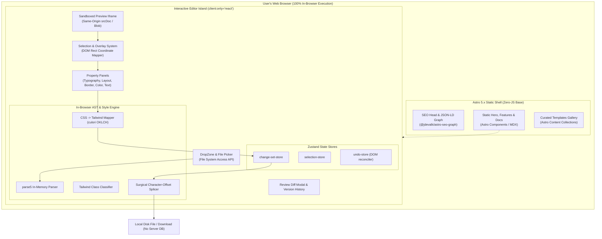

# Technical Requirements Document (TRD) — Visual HTML & Tailwind Editor

> **Document Status:** APPROVED FOR IMPLEMENTATION  
> **Architecture Pattern:** Astro 5.x Shell + React 19 Islands + In-Browser AST Engine  
> **Hosting & Infrastructure:** 100% Client-Side Static Deployment (Cloudflare Pages / Vercel Edge) — $0/mo

---

## 1. System Architecture Overview



---

## 2. Technology Stack & Dependencies

| Layer | Technology | Version | Rationale |
| :--- | :--- | :--- | :--- |
| **Framework Shell** | Astro | `^5.0.0` | Zero-JS static HTML, instant page load, best-in-class SEO. |
| **Island Runtime** | React + React-DOM | `^19.0.0` | Reactive state, rich component ecosystem for visual controls. |
| **Styling** | Tailwind CSS v4 | `^4.0.0` | High-performance CSS engine with `@tailwindcss/vite`. |
| **AST Parser** | `parse5` | `^7.1.2` | Accurate HTML5 parser with source code character offsets. |
| **Color Math** | `culori` | `^4.0.1` | Perceptual OKLCH distance for intelligent palette snapping. |
| **State Management** | `zustand` | `^5.0.0` | Zero-boilerplate, high-performance in-memory state store. |
| **Icons** | `lucide-react` | `^1.0.0` | Crisp, modern UI icons for toolbar and property panels. |
| **Animations** | `framer-motion` | `^12.0.0` | Smooth UI drawer, modal, and tooltip transitions. |
| **SEO Graph** | `@jdevalk/astro-seo-graph` | `^1.4.0` | Schema.org JSON-LD graph generator and SEO audit engine. |
| **Testing** | `vitest` + `jsdom` | `^3.0.0` | Fast in-memory unit testing for all AST & style operations. |

---

## 3. Detailed Component Specifications

### 3.1 In-Browser AST Engine (`src/lib/ast/`)

#### 3.1.1 Location Map Builder (`build-location-map.ts`)
* Parses raw HTML into an AST with `sourceCodeLocationInfo: true`.
* Generates a flat lookup map of every element's structural path, tag name, and attribute character offsets (`startOffset`, `endOffset`).

#### 3.1.2 Structural Path Grammar & Resolver (`resolve-path.ts`)
* Deterministically resolves `#id` or CSS nth-of-type selector paths (`html:nth-of-type(1) > body:nth-of-type(1) > main:nth-of-type(1) > div:nth-of-type(2)`).
* Operates identically on both jsdom/DOM instances and `parse5` AST nodes.

#### 3.1.3 Surgical AST Splicer (`splice.ts`)
* Applies atomic character replacements at exact byte positions.
* **Invariant:** Splices are sorted in **descending order of `startOffset`** so earlier replacements never shift subsequent coordinates.

```typescript
export interface Splice {
  startOffset: number;
  endOffset: number;
  replacement: string;
}

export function applySplices(html: string, splices: Splice[]): string {
  const sorted = [...splices].sort((a, b) => b.startOffset - a.startOffset);
  let result = html;
  for (const { startOffset, endOffset, replacement } of sorted) {
    result = result.slice(0, startOffset) + replacement + result.slice(endOffset);
  }
  return result;
}
```

---

### 3.2 Coordinate System & Selection Engine (`src/components/editor/SelectionOverlay.tsx`)

* **Isolation Principle:** The selection box is rendered in the **parent application context**, positioned over the iframe canvas using `getBoundingClientRect()` relative to the iframe bounds.
* **Why this matters:** No selection handles, outline classes, or highlight divs are ever injected into the user's HTML document, ensuring the user's code remains 100% pristine.
* **Zoom/Scroll Tracking:** Overlay position re-calculates on iframe scroll, window resize, and zoom changes.

---

### 3.3 Style Mutation & Forward Mapping Engine (`src/lib/tailwind/`)

1. **Live Drag Phase (60fps):**
   * While the user drags a slider or color picker, the editor directly updates `selectedElement.style.setProperty(prop, val)`.
   * This guarantees zero frame drops and avoids re-parsing the AST on every tick.
2. **Commit Phase (On Release / Blur):**
   * Value passes to `forwardMap(property, value, options)`.
   * If Tailwind is detected: produces utility class (e.g. `w-[240px]` or `bg-indigo-600` via OKLCH color snap).
   * If no Tailwind: writes to `style="..."` attribute.
   * Dispatches `EditRecord` to `change-set-store` and pushes previous state to `undo-store`.

---

### 3.4 Direct Content & Text Editing Engine

* Activated on element double-click.
* Sets `contenteditable="true"` on the target text node in the iframe.
* On `blur` or `Escape`/`Enter`:
  * Computes text node character offset within parent element.
  * Records `TextEditRecord` in `change-set-store`.
  * Splicer replaces inner text content accurately without disturbing opening/closing tags or attributes.

---

### 3.5 File Persistence Engine (`src/lib/fs/`)

```typescript
// src/lib/fs/file-system-access.ts
export async function saveFileDirectly(handle: FileSystemFileHandle, content: string): Promise<boolean> {
  try {
    const writable = await handle.createWritable();
    await writable.write(content);
    await writable.close();
    return true;
  } catch (err) {
    console.warn("Direct save failed, falling back to download", err);
    return false;
  }
}
```

* **Chrome/Edge/Brave:** Uses `showOpenFilePicker()` and `createWritable()`.
* **Firefox/Safari Fallback:** Triggers `URL.createObjectURL(new Blob([content], { type: 'text/html' }))` with `<a download>`.

---

## 4. Performance & Security Guardrails

1. **Sandboxed Iframe Execution:** Iframe uses `sandbox="allow-scripts allow-same-origin"` to isolate user scripts from parent app state.
2. **Sub-millisecond AST Splicing:** In-browser AST parsing and splicing completes in **< 3ms** for a 100KB HTML document.
3. **Memory Management:** Preview iframes are cleanly unmounted and garbage collected upon loading a new file.
4. **Zero Telemetry / Total Privacy:** No analytics trackers on user-loaded file contents.

---

## 5. SEO Architecture & Meta Specifications

* **Canonical URL Origin:** Set in `astro.config.mjs` (`site: "https://visualstyleeditor.com"`).
* **Automated Sitemap:** Configured via `@astrojs/sitemap`.
* **Structured Data:** JSON-LD `SoftwareApplication` declaring zero pricing and full feature availability.
