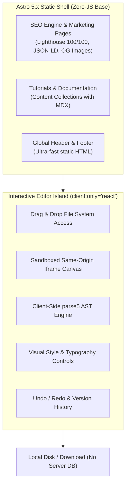

# Astro Web App Architecture & Technical Stack

> **Document Type:** Technical Architecture & Strategy  
> **Target Framework:** Astro 5.x + React Islands + Tailwind CSS v4  
> **Deployment Target:** 100% Static / Edge (Cloudflare Pages / Vercel / Netlify) — $0/month server cost  
> **Privacy Model:** 100% Local In-Browser Processing (Zero user files or code sent to remote servers)

---

## 1. Executive Summary & Why Astro.js

Building this visual style editor as an **Astro-powered web application** is the ideal architectural decision for three critical reasons:



1. **Unbeatable SEO & Organic Reach for Free User Acquisition:**
   - Astro produces pure static HTML with **zero client-side JavaScript overhead** by default.
   - Search engines can crawl landing pages, templates, feature guides, and how-to articles instantly.
   - Implements structured JSON-LD schemas (`SoftwareApplication`, `WebApplication`, `HowTo`), automated OpenGraph dynamic social cards, and sitemaps via `@jdevalk/astro-seo-graph`.

2. **100% Client-Side In-Browser Computation (Zero Backend Cost):**
   - The entire HTML parsing and modification engine (`parse5`, Tailwind classifier, CSS forward mapper, and AST splicer) runs **directly inside the user's web browser**.
   - No backend Node servers, no Docker containers, no database maintenance.
   - Hosting cost is **$0/month indefinitely** on Cloudflare Pages or Vercel, scaling effortlessly to millions of visits.

3. **Complete User Privacy & Data Security:**
   - Users and companies can safely drop proprietary landing pages, confidential client work, and paid templates into the editor without fear of data leaks, because **not a single byte of their code leaves their browser**.

---

## 2. Astro Islands Architecture Model

Astro's **Islands Architecture** separates static marketing content from heavy interactive client applications:

```text
/ (Root Route)
├── Astro Static Layout (Header, SEO Meta, Hero, Feature Showcase, Testimonials, Footer)
└── <VisualEditorIsland client:load /> ──► Mounts the React Visual Editor
```

### Routing Strategy

| Route | Architecture | Purpose |
| :--- | :--- | :--- |
| `/` | Astro Page + React Island (`client:load`) | Landing page with a live interactive "drop your file right here" hero. |
| `/editor` or `/app` | Fullscreen React Island (`client:only="react"`) | Distraction-free, full-viewport studio workspace for editing. |
| `/templates` | Astro Content Collections (SSG) | Curated free HTML/Tailwind starter templates users can open directly into the editor. |
| `/docs/*` | Astro Content Collections (SSG) | SEO-rich documentation, Tailwind cheat sheets, and tutorials. |
| `/changelog` | Astro SSG | Version updates, new feature logs. |

---

## 3. Technology Stack Specification

```text
┌─────────────────────────────────────────────────────────────────┐
│                          Astro 5.x                              │
│  ├── Static Site Generation (SSG)                               │
│  ├── @astrojs/react (React 19 Island Integration)               │
│  ├── @astrojs/sitemap & @jdevalk/astro-seo-graph                │
│  └── Tailwind CSS v4 (@tailwindcss/vite)                        │
└────────────────────────────────┬────────────────────────────────┘
                                 │ Mounts Island
┌────────────────────────────────▼────────────────────────────────┐
│                   Interactive React Island                      │
│  ├── State: Zustand (selection, change-set, history)            │
│  ├── AST & Parsing: parse5 (100% in-browser bundle)             │
│  ├── Color Math: culori (perceptual OKLCH distance & hex)       │
│  ├── Icons: Lucide React                                        │
│  ├── UI Motion: Framer Motion (subtle micro-interactions)       │
│  └── File APIs: Native File System Access API + Blob fallbacks  │
└─────────────────────────────────────────────────────────────────┘
```

### Core Libraries & Bundles

* **Framework:** `astro` (v5.x) + `@astrojs/react`
* **Styling:** Tailwind CSS v4 (`@tailwindcss/vite`)
* **AST Engine:** `parse5` (pure JavaScript, compiles seamlessly into browser bundles)
* **Color Processing:** `culori` (OKLCH color difference calculation for theme swatch snapping)
* **State Management:** `zustand` (lightweight, zero boilerplate)
* **Icons:** `lucide-react` (clean, modern icons for all visual controls)

---

## 4. Client-Side AST Engine (Eliminating the Backend)

In the older version of the codebase, a Node server ran `parse5` and returned updated HTML strings over HTTP (`POST /api/apply-edits`). 

In the Astro web app architecture, this is refactored into a **Client-Side AST Service** (`src/lib/ast/`):

```typescript
// src/lib/ast/apply-edits-browser.ts
import { parseFragment, type DefaultTreeAdapterMap } from "parse5";
import { resolveStructuralPath } from "./resolve-path";
import { applySplices, type Splice } from "./splice";
import { setStyleProperty } from "./style-attr";
import type { SaveRequestEdit, SaveResponse, SaveConflict } from "@/types";

export function applyEditsClientSide(html: string, edits: SaveRequestEdit[]): SaveResponse {
  const { document } = buildLocationMap(html);
  const htmlEl = elementChildren(document).find((el) => el.tagName === "html");
  if (!htmlEl) {
    return { ok: false, conflicts: [{ structuralPath: "root", reason: "not-found" }] };
  }

  const splices: Splice[] = [];
  const conflicts: SaveConflict[] = [];

  for (const edit of edits) {
    const node = resolveStructuralPath(htmlEl, edit.structuralPath);
    if (!node) {
      conflicts.push({ structuralPath: edit.structuralPath, reason: "not-found" });
      continue;
    }

    if (edit.kind === "class") {
      const classAttr = node.sourceCodeLocation?.attrs?.["class"];
      const newClassString = edit.newClassList.join(" ");

      if (classAttr) {
        splices.push({
          startOffset: classAttr.startOffset,
          endOffset: classAttr.endOffset,
          replacement: `class="${newClassString}"`,
        });
      } else {
        const tagStart = node.sourceCodeLocation!.startTag!.startOffset;
        const insertAt = tagStart + node.tagName.length + 1;
        splices.push({
          startOffset: insertAt,
          endOffset: insertAt,
          replacement: ` class="${newClassString}"`,
        });
      }
    } else if (edit.kind === "style") {
      const styleAttr = node.sourceCodeLocation?.attrs?.["style"];
      const currentStyleValue = getAttr(node, "style") ?? "";
      const newStyleValue = setStyleProperty(currentStyleValue, edit.styleProperty, edit.newStyleValue);

      if (styleAttr) {
        splices.push({
          startOffset: styleAttr.startOffset,
          endOffset: styleAttr.endOffset,
          replacement: `style="${newStyleValue}"`,
        });
      } else {
        const tagStart = node.sourceCodeLocation!.startTag!.startOffset;
        const insertAt = tagStart + node.tagName.length + 1;
        splices.push({
          startOffset: insertAt,
          endOffset: insertAt,
          replacement: ` style="${newStyleValue}"`,
        });
      }
    }
  }

  if (conflicts.length > 0) {
    return { ok: false, conflicts };
  }

  const updatedHtml = applySplices(html, splices);
  return { ok: true, html: updatedHtml };
}
```

> [!TIP]
> Executing this in-browser takes **under 2 milliseconds** for typical 50KB–500KB landing pages, eliminating network round-trips and giving users instant save performance.

---

## 5. SEO & Growth Engine

To ensure the free web app ranks #1 on Google for relevant search queries, Astro is configured with the following SEO stack:

1. **High-Intent Organic Keywords:**
   - *"online visual html editor"*
   - *"free tailwind css visual editor"*
   - *"no-code html styler"*
   - *"edit html visually in browser"*
   - *"tweak ai generated website visually"*
2. **Dynamic Social Cards (OpenGraph / Twitter):**
   - Automated SVG/Canvas generation at build time for dynamic preview cards.
3. **Structured JSON-LD Schema:**
   - Declares `SoftwareApplication` with `"offers": { "@type": "Offer", "price": "0" }` to appear in Google's rich software snippets.
4. **Templates Library for Long-Tail Search Traffic:**
   - Landing page templates, pricing cards, hero sections, and newsletter layouts that users can preview, tweak in the editor, and download for free.

---

## 6. Hosting & CI/CD Pipeline

```text
GitHub Repo ──► Push to main ──► Cloudflare Pages / Vercel (npm run build) ──► Global Edge CDN (0ms Cold Starts)
```

* **Build Output:** Pure static directory (`dist/`).
* **Bandwidth & Compute:** Unlimited static hosting on Cloudflare Pages free tier.
* **Security Headers:** Implemented via `public/_headers` (Content-Security-Policy for sandboxed iframes).
