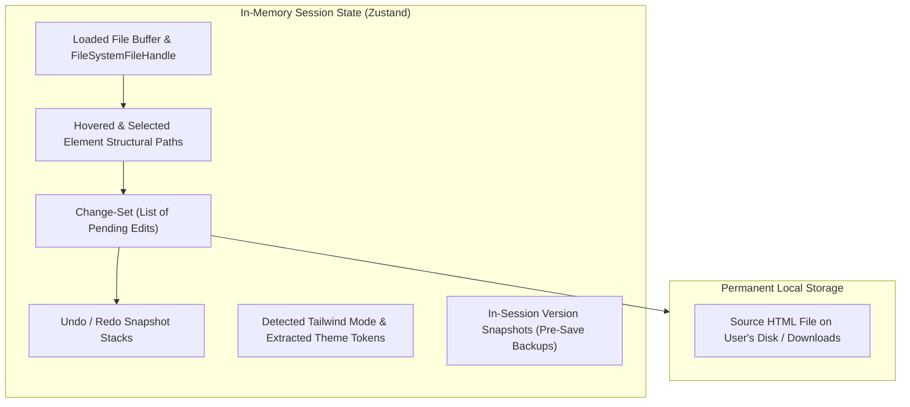

# Data Contracts & Domain Types

> **Architecture:** 100% Client-Side In-Memory State & TypeScript Domain Types  
> **Database:** None (Zero server-side persistence, 100% privacy)

---

## 1. State Architecture Overview

Because the web application runs entirely within the user's browser, there is no remote database. Application state is partitioned into three distinct lifecycles:



---

## 2. Core Domain Types Specification

Canonical TypeScript domain interfaces (defined in `@vse/shared` / `src/types/`):

```typescript
export type TailwindMode = "none" | "v3-cdn" | "v4-cdn";

export interface ThemeColorToken {
  /** e.g. "red-500", or a custom token like "brand-purple" */
  name: string;
  /** Normalized hex or CSS color-function string (e.g. "#6366f1") */
  value: string;
}

export interface ThemeFontToken {
  /** e.g. "sans", "serif", or "display" */
  name: string;
  /** Font family stack */
  stack: string;
}

export interface ThemeMap {
  mode: TailwindMode;
  colors: ThemeColorToken[];
  fonts: ThemeFontToken[];
}

export type EditableProperty =
  | "width" | "height"
  | "font-size" | "font-weight" | "font-family" | "line-height" | "letter-spacing" | "text-align"
  | "border-width" | "border-style" | "border-radius" | "border-color"
  | "text-color" | "background-color"
  | "text-content"; // Roadmap: Direct inline text editing

export interface LocationEntry {
  structuralPath: string;
  tag: string;
  classAttrRange?: { startOffset: number; endOffset: number };
  styleAttrRange?: { startOffset: number; endOffset: number };
  currentClassList: string[];
}

export interface ClassEditRecord {
  kind: "class";
  structuralPath: string;
  property: EditableProperty;
  oldClassList: string[];
  newClassList: string[];
  timestamp: string; // ISO 8601
}

export interface StyleEditRecord {
  kind: "style";
  structuralPath: string;
  property: EditableProperty;
  styleProperty: string;
  oldStyleValue: string;
  newStyleValue: string;
  timestamp: string; // ISO 8601
}

export interface TextEditRecord {
  kind: "text";
  structuralPath: string;
  oldText: string;
  newText: string;
  timestamp: string; // ISO 8601
}

export type EditRecord = ClassEditRecord | StyleEditRecord | TextEditRecord;

export type SaveRequestEdit =
  | { kind: "class"; structuralPath: string; newClassList: string[] }
  | { kind: "style"; structuralPath: string; styleProperty: string; newStyleValue: string }
  | { kind: "text"; structuralPath: string; newText: string };

export interface SaveConflict {
  structuralPath: string;
  reason: "not-found" | "ambiguous";
}

export type SaveResponse =
  | { ok: true; html: string }
  | { ok: false; conflicts: SaveConflict[] };
```

---

## 3. Structural Path Grammar (Element Identifier)

The `structuralPath` string acts as an exact, deterministic identifier for any DOM node in an arbitrary HTML document without mutating the underlying source file:

```text
StructuralPath  := IdPath | ChainPath
IdPath          := "#" Identifier
ChainPath       := Step ( ">" Step )*
Step            := TagName ":nth-of-type(" PositiveInteger ")"
```

### Examples:
* `#hero-cta`
* `html:nth-of-type(1) > body:nth-of-type(1) > main:nth-of-type(1) > section:nth-of-type(2) > h1:nth-of-type(1)`

---

## 4. AST Splicing Contract

The AST engine operates on character-level string splices. Each splice is an atomic range replacement:

```typescript
export interface Splice {
  startOffset: number; // 0-indexed byte offset in original HTML
  endOffset: number;   // 0-indexed byte offset in original HTML
  replacement: string; // The new attribute string or text content
}
```

**Splicing Invariant:** Splices are sorted in **descending order of `startOffset`** before application so that earlier replacements never invalidate or shift the byte offsets of subsequent operations.
