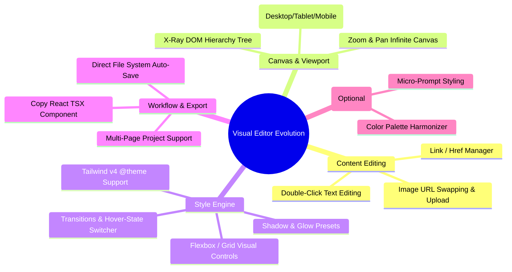

# Features & Improvements Roadmap

> **Product:** Visual Style Editor (Web Edition)  
> **Vision:** The fastest, cleanest, zero-lock-in visual editor for HTML & Tailwind web pages.

---

## 1. High-Impact Enhancements Overview



---

## 2. Detailed Feature Specifications

### 2.1 Direct Inline Text Editing (The #1 User Request)
* **Problem:** Non-developers want to change headlines, CTA text, and body copy directly on screen without touching code.
* **Solution:**
  * When double-clicking a text-bearing element (`<h1>`, `<p>`, `<a>`, `<button>`, `<span>`), activate an inline editable overlay (`contenteditable`).
  * On blur or `Enter`, record a `TextEditRecord` in the change-set.
  * In the AST splicing engine, splice the inner text node directly at its exact byte offset in the source HTML.

### 2.2 Image & Media Swapping
* **Capabilities:**
  * Clicking an `` tag shows an "Image Settings" panel in the sidebar.
  * Quick URL input with instant preview.
  * Drag-and-drop local image replacement (automatically embeds as an optimized Base64 data URL or updates relative paths).
  * `alt` text and aspect ratio controls for SEO accessibility.

### 2.3 Responsive Device Viewport Controls
* **Capabilities:**
  * Toolbar selector for **Desktop (100% / 1440px)**, **Tablet (768px)**, and **Mobile (375px)**.
  * Smooth animated canvas resizing with custom iframe zoom scaling.
  * Tailwind breakpoint-aware editing: when viewing in mobile mode, apply classes with the appropriate responsive prefixes (or raw styles).

### 2.4 Hover & Active State Styler
* **Capabilities:**
  * Toggle button in the property panel: `[ Default | :hover | :focus | :active ]`.
  * In Tailwind mode, styling while `:hover` is selected automatically prefixes utility classes with `hover:` (e.g. `hover:bg-blue-600`).

### 2.5 Element Tree / Layers Panel (X-Ray View)
* **Capabilities:**
  * Collapsible left sidebar displaying the DOM hierarchy (`body > main > section.hero > div.container > h1`).
  * Hovering an item in the tree highlights it on the canvas.
  * Allows selecting invisible, zero-height, or absolute-positioned elements that are tricky to click directly on canvas.
  * Basic element actions: **Delete** (`Backspace`), **Duplicate** (`Ctrl/Cmd + D`), and **Hide/Show**.

### 2.6 Modern Studio UI / UX Redesign
* **Aesthetic Standard:**
  * Sleek dark-mode aesthetic with frosted glass headers (`backdrop-blur-md`).
  * Smooth Framer Motion transitions for drawers, modals, and property tooltips.
  * Visual color palette swatches generated automatically from the document's Tailwind theme or dominant colors.
  * Mini breadcrumb navigator at the bottom of the viewport (`div > section > card > button.primary`).

---

## 3. Phased Implementation Milestones

```text
┌────────────────────────────────────────────────────────────────────────┐
│  Phase 1: Astro Shell & 100% In-Browser Engine (Foundational)          │
│  • Astro 5 project structure + React Island integration                │
│  • Migrate parse5 AST splicing to 100% client-side (no backend)        │
│  • Zero-cost deployment on Cloudflare Pages / Vercel                   │
├────────────────────────────────────────────────────────────────────────┤
│  Phase 2: Text & Asset Editing (Core No-Code)                          │
│  • Double-click inline text editing                                    │
│  • Image URL & alt-text editor                                         │
│  • Link / button href editor                                           │
├────────────────────────────────────────────────────────────────────────┤
│  Phase 3: Viewport & Canvas Polish (Pro UX)                            │
│  • Responsive device switcher (Desktop / Tablet / Mobile)              │
│  • Canvas zoom / pan controls                                          │
│  • DOM Layers tree sidebar                                             │
├────────────────────────────────────────────────────────────────────────┤
│  Phase 4: Public Launch & Growth (SEO Engine)                          │
│  • High-converting Astro landing page + Free Template Library          │
│  • Schema.org JSON-LD + dynamic OpenGraph sharing cards                │
│  • Launch on Product Hunt, X (Twitter), and Reddit                     │
└────────────────────────────────────────────────────────────────────────┘
```
